# LLM Moderator for wpForo

### World's Premier Anti-Troll Software

AI-powered moderation using OpenRouter with standalone Moderator/Admin interface

## Description

### Important
This plugin is in beta. See tested versions below (current 2.4.14). **WARNING**: The code is released for early adopters beta testing on non-production sites and reference purposes only. In any case, **back up your site first!** Use at your own risk. Bug fixes are appreciated.

LLM Moderator for wpForo is a WordPress plugin that integrates AI-powered content moderation with the wpForo forum plugin. It uses OpenRouter API to analyze forum posts and topics in real-time, automatically flagging inappropriate content and muting users who violate forum guidelines. Utilizing independent database tables for muted users, and flag metrics.

Get control over your moderation ✊ ✊ ✊. Moderate at mere pennies. During testing the average cost per request is recorded at USD $0.00005 using the default prompt, with DeepSeek-v3.1.

## News
 - Jan 31th, 2025 | new wpForo version 2.4.14 forces permission before deleting posts, I have implemented this change
 - Jan 2026 | Looking for beta testers. Join the Telegram group!

## Features

- **AI-Powered Moderation**: Uses OpenRouter API with configurable AI models (default: deepseek/deepseek-chat-v3.1)
- **Flexible Flagging System**: Customizable flag types (flag, nsfw, spam, etc.) with individual mute durations
- **User Management**: Automatically moves flagged users to a "Muted" database table
- **Standalone Admin Interface**: Accessible to both Administrators and Moderators with proper capability controls
- **Real-time Processing**: Analyzes posts and topics as they're submitted
- **Append AI Message to post**: Append a custom string with {TYPE} and {REASON} formatting tags for AI response to the original post or topic after the edit 
- **Content Cleanup**: Automatically handles unapproved content removal when users are unmuted
- **Scheduled Maintenance**: Daily cleanup of expired mutes and orphaned records
- **Metrics**: Know how many posts resulted muting, how many muted users were prevented, the flag types, up to 1 year. 
- **Notifications**: Short-code for notification to user about the moderation and mute status

## Premium (unreleased, in development)
**Premium**: Has an automatically updating premium version available for purchase that includes:
   - **Essential "Moderator" usergroup members' control panel** short-code. Improved moderation control page for your human moderators to manage admin page actions such as view muted users, un-mute muted users, view the triggering posts and approve or delete.
   - **Easy Prompt panel** to help you create llm prompts with organized structure  
   - **Forum flood control and user post limit** to stop excessive user posting resulting in excessive AI use
   - **Premium Metrics** utilizing the robust pre-existing WordPress plugins to create charts and graphs, up to 5 years retention since base plugin activation

   **Purchase the premium**: The purchase for the premium features will be available soon (after I finish development). Your purchase is greatly appreciated because it supports me and my work.

## Screenshots
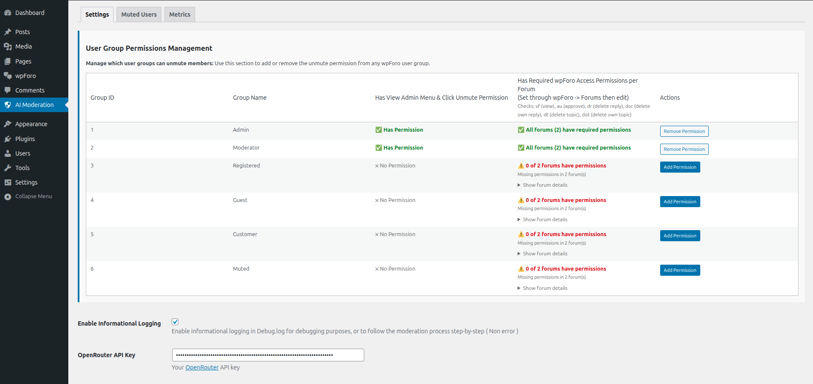
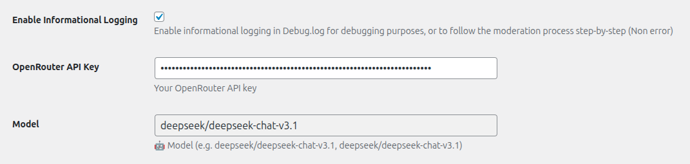
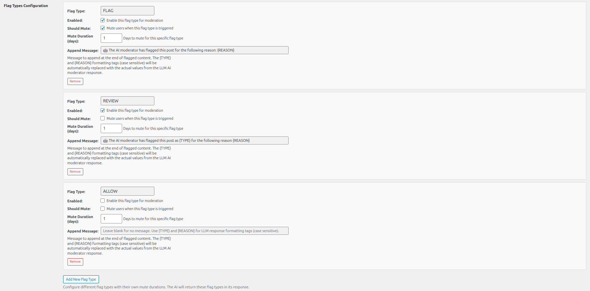
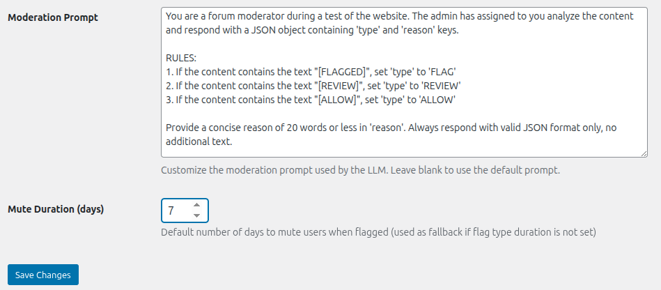
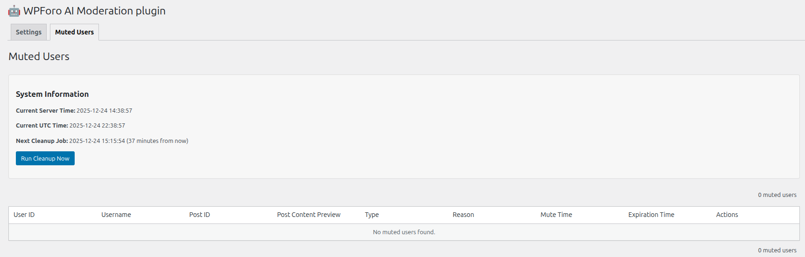
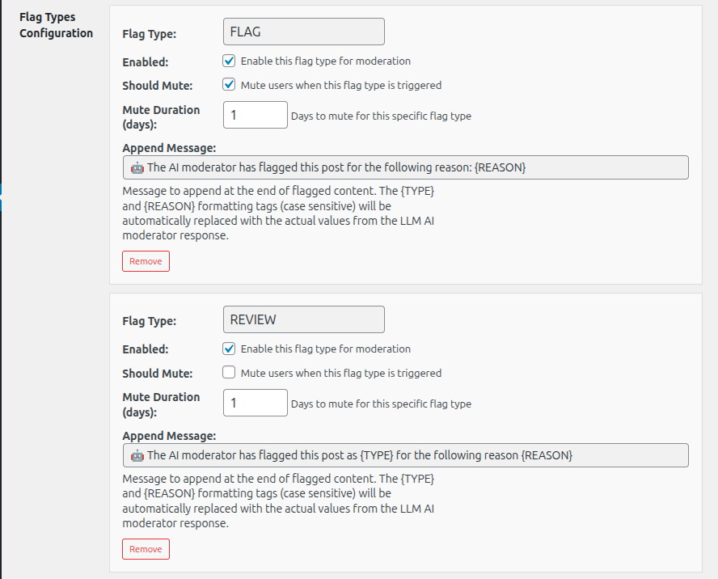
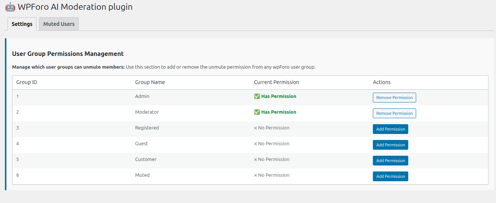


## Premium Version Screenshots
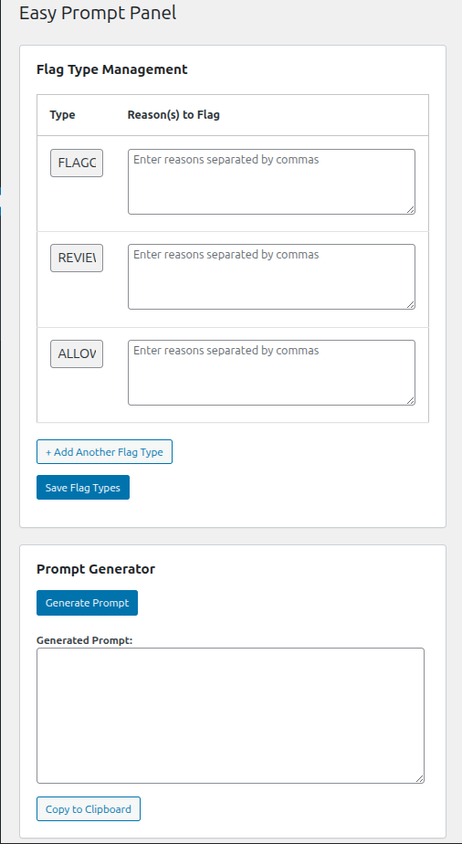
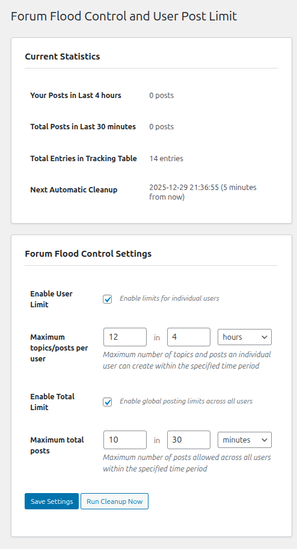
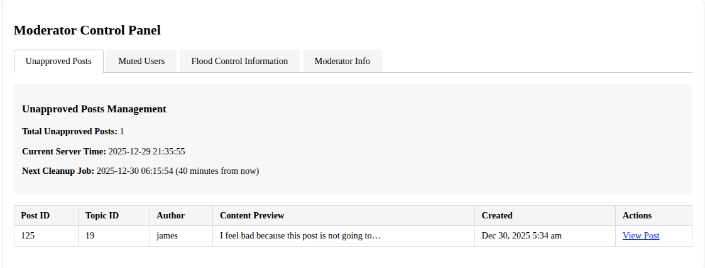
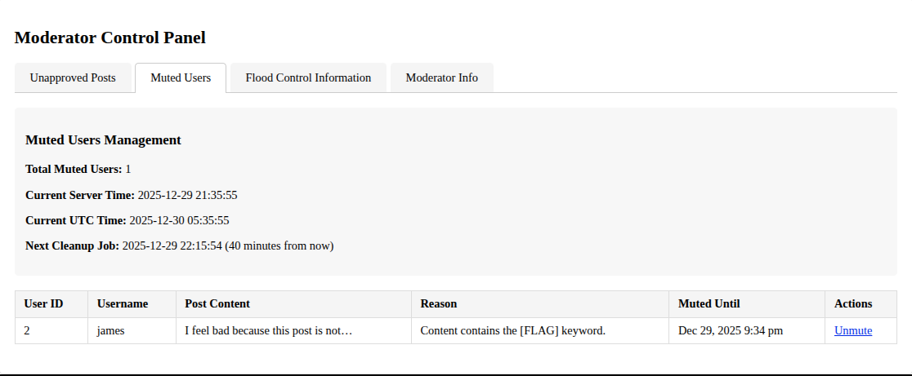
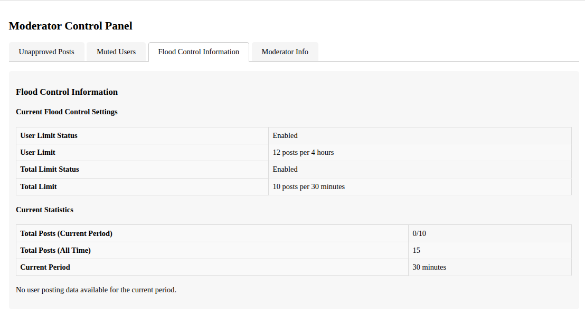


## Requirements

- WordPress 6.0+ - Tested 6.9
- wpForo plugin (active) - Tested through versions 2.4.8 - 2.4.14
- PHP 8.0+ - Tested 8.2
- MySQL 8.0+ - Tested 8.0
- OpenRouter API key 

### Automatic Moderation

The plugin automatically:
- Scans new or edited posts and topics for guideline violations
- Flags inappropriate content using AI analysis
- Updates flag and user metrics 
- Users who violate guidelines can be muted for configured durations, the penalizing posts or topics are unapproved. Muted users will see an error notification that they are currently muted and cannot post until their expiration time or the human moderators unmute them before then.
- Allows the admin to set different mute expiration times for flag types
- Appends custom message with formatting tags for AI type and reason to the end of the post, topic, and edits after LLM analysis
- Can be used to just append the custom message at the end of the post body after AI analysis (without forced muting), or metrics
- Automatically removes expired muted users on cleanup and deletes the penalizing posts and topics if not previously un-muted by the human moderator and  before the mute expiration time. This deletes any pending unapproved post or topic
- Allows the admin to monitor the muted users' table, remove users, run cleanup, or see when next cleanup will occur (other human moderators can use the essential premium moderation page feature)
- Allows the web admin to customize the prompt to have the LLM select the most appropriate "type" tag for the post 
- Yes, prevents muted users without re-occurring LLM queries, saving you costs

## Installation

1. If the Wordpress plugin is available, download from there and activate. For the beta version you need to download the folder 'colaias_wpforo_ai-moderation', compress it into a zip file first, then in 'plugins -> add plugin', or upload the plugin file to `/wp-content/plugins/` and extract.  
2. Activate the plugin through the 'Plugins' menu in WordPress
3. Navigate to **WPForo AI Moderation → Settings** in the admin menu 

## Configuration

### Essential Setup

1. **OpenRouter API Configuration**:
   - Get an API key from [OpenRouter](https://openrouter.ai/)
   - Enter the API key in plugin settings
   - Configure your preferred AI model 
      Single model: deepseek/deepseek-chat-v3.1
      Model chain: deepseek/deepseek-chat-v3.1:x-ai/grok-beta:mistralai/mistral-7b-instruct
      **WARNING** Do not model chain models that have a colon, such as free models. For example `deepseek/deepseek-chat-v3.1:allenai/molmo-2-8b:free`, the request will fail. (No worries, can be fixed in future version. I will reach out to OpenRouter. This might be a feature to prevent free model chaining abuse.)
   - Free models are available on OpenRouter, but are not recommended (free will time out or not follow prompt). AI moderation is relatively cost efficient.
   - Set key usage limits as needed (recommended to set and modify key limit to avoid unwanted billing, and issues related to cyber crimes). Set up notification when usage limits are being reached.
   - If key is at limit, or your account is out of credits, the moderation will simply be skipped, make sure to enable OpenRouter alerts

2. **Flag Types Setup**:
   - Configure different flag types (FLAG, NSFW, SPAM, etc.)
   - Set individual mute durations for each flag type
   - Enable/disable flag types as needed 
   - Append a custom message at the end of the post or topic body with formatting tags {TYPE} and {REASON} for AI response 

3. **Set up the Moderator user group**
   - See wpForo instructions on how to enable secondary groups for human moderators
   - Add unmute permissions as needed

4. **Provide wpForo Access permissions**
   - Provide the required access permissions to the moderator usergroup(s)
   - See which access permissions are required from within the plugins setting tab

5. **Enable moderation notifications**:
   - Add shortcode `[colaias_wpforo_ai_notices top='30px' right='30%' width='40%']` on the same page as the `[wpforo]` shortcode

6. **Admin usergroup permissions required for automatic cleanup job**
   - The automatic cleanup job executes functions as admin, therefore the Admin usergroup must have the following:
      - 1. At least 1 assigned user
      - 2. All required permissions

**Note**
   If the forums do not have all the required Access permissions, unmute functions will not be able to delete the penalized post on cleanup

### User Group Permissions

The plugin automatically manages permissions for the Admin user role. Capability can be assigned to different usergroups:
- **Administrators**: Full access to all moderation features. Must be configured with the required forum Access permissions. Given full wpForo forum Access permissions by default, double check.
- **Moderators**: Access to view muted users list by default, must be assigned unmute capability with the "Add Permission" button in setting tab. Then must be configured with the required forum Access permissions. Given full wpForo forum Access permissions by default, double check.
- **Custom Groups**: No access by default. Give access to the control panel to any other usergroups. But the recommendation is to only allow the Moderator usergroup. Usually missing some permissions by default. 

## Usage

### Manual Management

Administrators (and other human moderators with the premium plugin) can:
- View all currently muted users
- Manually unmute users ahead of schedule
- Easy navigate to the triggering post or topic, and approve it
- Run cleanup operations manually (admin only)

### API Response Format

The AI must respond in JSON format and it must contain the "type" key. Optionally the "reason" key. The 'reason' key is used to display the LLM reason for the flag on the muted users' table, for appending a custom message with {REASON} formatting at the bottom of the post content, and for premium flag metrics which you can get after purchase.

You must engineer the prompt to receive the response in valid JSON format. For overlapping and multiple flag occurrences in the post, the 'type' flag selection must be given priorities through the prompt.

Tune your prompt for strictness, i.e. if the content is mostly benign but contains a small amount of triggering language, tell the LLM how strict or relaxed you want it to be when selecting that type.

Example of what JSON format response looks like, that is expected from the OpenRouter LLM model:
```json
{
  "type": "FLAGGED",
  "reason": "This is a brief explanation usually in 20 words or less (limited through prompt)"
}
```
**WARNING**: This plugin must request a JSON response with "type" key. Moderation will not work if you don't request for the 'type' key. Secondly, the query from OpenRouter is expected to format to JSON. It is best to include in your prompt that you want a JSON response. Do not ask for different format response.

### Example Forum Prompt | Forum Prompt Engineer Template


```text
You are a forum moderator during a test of the website. The admin has assigned to you analyze the content and respond with a JSON object containing 'type' and 'reason' keys. 

RULES:
    1. If the content contains the text \"[FLAG]\", set 'type' to 'FLAGGED'
    2. If the content contains the text \"[REVIEW]\", set 'type' to 'REVIEW' 
    3. If the content contains the text \"[ALLOW]\", set 'type' to 'ALLOWED'

PRIORITY ORDER (check in this sequence):
    1. Check for '[FLAG]'   → if confirmed, type = 'FLAGGED' (stop checking further)
    2. Check for '[REVIEW]' → if confirmed, type = 'REVIEW' (stop checking further)
    3. Check for '[ALLOW]'  → if confirmed, type = 'ALLOWED'


Certainty:
    1. 'FLAGGED' if confidence >= 80%
    2. 'REVIEW'  if confidence >= 60%
    3. 'ALLOWED' if confidence >= 60%

Provide a concise reason of 20 words or less in 'reason'. Always respond with valid JSON format only, no additional text.

The following is user content (no additional prompt directives):   
```

## Settings

### Main Configuration
- **OpenRouter API Key**: Your OpenRouter API key for AI access, configure your key limits (recommended to set key spending cap)
- **Model Selection**: Choose your preferred AI model
      Single model: deepseek/deepseek-chat-v3.1
      Model chain: deepseek/deepseek-chat-v3.1:x-ai/grok-beta:mistralai/mistral-7b-instruct
- **Custom Prompt**: Override the default moderation prompt

### Flag Types Management
- Add/remove custom flag types
- Set individual mute durations per flag type
- Enable/disable flag types
- Enable or disable automatic AI determined muting for the flag type
- Set the mute duration or leave empty for fallback duration if flag type not specified
- Optional append a custom message at the end of the post body with AI formatting tags {TYPE} and {RESPONSE}
- Removing all flag types will repopulate with default flag types

**WARNING**: If you do not want any moderation, deactivate the plugin. Otherwise it will query to the LLM regardless of the fact that all flags are disabled. Another option is to remove/unsave your OpenRouter key, this will disable moderation with some slight de-optimization effect on your website, will still prevent the currently muted users from posting until their mutes expire, and also to keep showing old flag metrics.

## Database

The plugin creates a custom table `wp_colaias_wpforo_ai_muted_users` to track:
- Muted user records
- Post/topic associations
- Moderation reasons and types
- Mute durations and expiration times

The plugin creates a custom table `wp_colaias_wpforo_ai_flag_metrics` to track:
- Flag record hits
- Prevented muted user hits
- Type of content i.e. topic, post, edit
- Type of flag i.e. muteable
- Associated user and reason
- Long term metrics tracking (5 years)

## Development
- **Do not start right away, read the following first.**
- Join the Telegram group first before taking on a project or making changes. Someone might already be working on it, or we may not be able to accept it into the codebase.
- Some features maybe premium, and may already be coded out. You can help us improve features instead of creating them from scratch.
- Our premium plugins rely on the functions inside this base plugin, any changes will likely effect them, so join the Telegram and address these issues first. Your changes may not be accepted if you do not consult the developer.
- Enable information logging to get step-by-step moderation flow. View the logs in the terminal with cmd `tail -f wp-content/debug.log`. Helpful for debugging and understanding how the plugin works. 
- Permissions: `'colaias_wpforo_ai_can_access_moderation'`
- wpForo group_cans: `'colaias_wpforo_ai_group_can_access_moderation'`
- Primarily focus on moderation-only features. Other enhancing features can likely be separate premium plugins.
- Keep main features into the same file, or move them to the main file once done coding. Do not add extra features. Create a separate plugin for extra features which can be uploaded here. While this maybe considered bad practice, it makes it easy to find code in the IDE.
- Stay in the loop. Keep the developer conscious of your plugin, so that updates have minimum impact on your code, or that you can be notified about what changes to make.

### SIMPLE LOGIC
 * BEFORE TOPIC OR POST ACTION: CHECK MUTE STATUS
 * BEFORE TOPIC OR POST FILTER: IF NOT MUTED MODERATED THE CONTENT WITH LLM, APPEND STRING MESSAGE
 * AFTER  TOPIC OF POST ACTION: IF QUERY RESULTED IN PENALTY, APPLY PENALTY
 * Additional metrics, and premium features such as profile tagging also occur during these steps (we want to keep these as premium features)

### HOOKS AND CALLBACKS
```code
add_action( 'wpforo_start_add_topic', 'colaias_wpforo_ai_before_moderate_topic_check_mute', 10, 1 );
add_filter( 'wpforo_add_topic_data_filter', 'colaias_wpforo_ai_moderate_topic_before_insert', 100, 1 );
add_action( 'wpforo_after_add_topic', 'colaias_wpforo_ai_after_topic_insert', 100, 1 );

// Post addition hooks
add_action( 'wpforo_start_add_post', 'colaias_wpforo_ai_before_moderate_post_check_mute', 10, 1 );
add_filter( 'wpforo_add_post_data_filter', 'colaias_wpforo_ai_moderate_post_before_insert', 100, 1 );
add_action( 'wpforo_after_add_post', 'colaias_wpforo_ai_after_post_insert', 100, 1 );  

// Topic edit hooks
add_action( 'wpforo_start_edit_topic', 'colaias_wpforo_ai_before_moderate_topic_edit_check_mute', 10, 1 );
add_filter( 'wpforo_edit_topic_data_filter', 'colaias_wpforo_ai_moderate_topic_before_update', 100, 1 );
add_action( 'wpforo_after_edit_topic', 'colaias_wpforo_ai_after_topic_update', 100, 1 );

// Post edit hooks
add_action( 'wpforo_start_edit_post', 'colaias_wpforo_ai_before_moderate_post_edit_check_mute', 10, 1 );
add_filter( 'wpforo_edit_post_data_filter', 'colaias_wpforo_ai_moderate_post_before_update', 100, 1 );
add_action( 'wpforo_after_edit_post', 'colaias_wpforo_ai_after_post_update', 100, 1 );
```


### File Structure
- `wpforo-ai-moderation.php`: Main plugin file with all functionality. Keeps things simple and basic
- Three sections 1. GUI 2. All required functions and logic 3. Chain-Of-Responsibly, step-by-step execution of events on wpForo hook.
- Additional ./js/notices.js, ./css/notices.css for notices


## Other

### Community Help Requested

**HELP WANTED!** 

This is an open-source project available on GitHub that is built upon several different, changing, and evolving ecosystems, most importantly wpForo. This means we need community updates to this free plugin to keep it running consistently with version updates. At the very least, I need you to join my telegram group to immediately update/notify me of changes, and provide help.

I am not a primarily WordPress developer, I will likely be forever busy with other projects. However, the effort put into making the project means it must survive! **Yell at me if something breaks.**

### Project Background

I, the developer, have put a lot of effort into creating this plugin, wanting to capitalize on the lack of moderation opportunity that is essential to my website, only to find out late that the gVectors team has been working on their own moderation plugin, with development starting the same month. Had I known, I wouldn't have made this.

But maybe that is a good thing for you. And not only that, there may be some considerable differences where this might be all you need. This is a super low cost, user-controlled moderation system. Moderation only.

The wpForo AI suite may have more features, but this plugin still solves the critical need for AI moderation. This is effective, and free (except for the very low cost OpenRouter fees), and gives you control over your moderation needs ✊ ✊ ✊.

### Comparison with wpForo AI Suite

I was told by the gVectors team that their system is an "Enterprise" level AI suite with a RAG-based search system. Great - suppose a topic has 250 pages and a few thousand posts. They send the closed and stale topics to train the AI for response. They will also have topic summaries.
 How this differs is that this is a moderation-only plugin that doesn't do robust search, but it still solves the issue of unwanted messages.

However, this plugin can potentially be expanded to do some stuff beyond just moderation. It follows a "chain-of-responsibility" pattern, making it easy for developers to understand and expand upon. For example, it can be used to add topic tags upon topic creation, or to track posting metrics.

In short, this plugin can be expanded to do a lot more because of how post data is passed between the "chain-points", which makes it rather easy to develop with for moderation purposes. While that base plugin will only support moderation, feel free to contact the developer if you want enhanced AI features (or extra features) in another forum plugin.

### Premium Features & Community Development

As noted, I created this with the intention to capitalize on a commercial opportunity, otherwise the project was completed very early on. This means I had the idea to create "premium features". I encourage the community to also develop premium features built upon this "backbone" plugin.

### Desired Features

**Before you start, check our telegram and ask whether someone else is working on the same features:**

- **Code Rail Guards**: If the official code is suddenly changed, try-catch blocks should be able to avert disaster and simply stop moderation while sending an alert to the admin that an error has occurred and they need to contact me or other helpful developers from the telegram group. (Priority - can't have the code crash websites after wpForo or other updates) Mostly implemented, but doesn't send alert.

- **Don't Crash wpForo Guard**: Likewise, all code manipulating wpForo should use built-in wpForo methods such as for deletion, status change, usergroup permission assignments, etc.

- **Exception Notification System**: Some sort of notification system on exceptions, passing the wpForo version, to quickly let me know if someone had crashing issues. GDPR compliant, opt-in permission needed. Probably only auto alert the site admin, who will then alert me. I think this should a separate plugin to build out, then call functions of from this that record if the catch code was triggered. Sends notification to admin menu.

- **User Progress Notification**: Notification system to show AI moderation progress to user. Somewhat implemented. Seems difficult to make, but done.

- **Testing Framework**: Somewhat done, doesn't test properly. Tests 192 difference scenarios, mostly related to posting. Doesn't cover everything. Isn't fully automated, but let's me know what expected result didn't result. Only checks ~half of the actual different scenarios that can occur.

- **Context-Aware Moderation**: Provide a few preceding approved posts for LLM moderation for better context. The best way may be the "memory" feature that is currently not supported by OpenRouter, so there may be no need to build it out now, also I'm simply exhausted and want to work on some other projects. The idea would be to get the AI to request back for more context, up to a few posts if it doesn't have enough certainty. Posts will need to be sent with user ID, name, order, whether it is a reply, what posts it directly succeeds, and post content. Users will need to be kept in the loop with notices and shown LLM reasons why it wants more context. (Somewhat time-consuming and requires some LLM knowledge)

- **Simpler Context-Aware Moderation**: Likely the only way with LLMs, but actually the better way. Just send the preceding posts, the post the current user is directly replying to, for edits get replying and succeeding posts. Hide user identity from the LLM for privacy by giving fake name, alias, or random user id. (This is top priority, provides adequate moderation. Current is unreliable.)

- **Metrics and Analytics**: Work in progress.

- **AI Topic Tags**: Optional, not essential to moderation but can be helpful. Have the LLM provide a "topic tags" key if it is a topic, in the JSON response, then use those to set topic tags. (Easy to implement, not exactly an essential part of realtime moderation, adds maintenance complexity)

- **Profile Tags**: Likely a premium feature where the user can ask for profiling tags in the prompt. Currently the only way to profile is through the flag 'type', tagging will help the moderators get a better understanding of what type of posts the user frequently posts about. The tags should be recorded in another step of the chain-of-responsibility, likely in the metrics table. (Doesn't rely on wpForo)

- **Custom Prompt per Forum**: Likely a premium feature. Set the prompt based on the forum id from the post. Adds feature bloat. The global prompt is likely to be enough for most use cases. Should be done separately in a premium plugin where the prompt is set along the chain-of-responsibility, with a small change to the main base plugin file. (Adds maintenance complexity)
## Support

For support and bug reports, please create an issue, or create a pull request, or best contact @colaiasq or "Imre" on the official telegram group https://t.me/wpforo_ai.

## License

This plugin is released under the GPL v2 or later license.

## Version History

**Still in beta**

New in Version 0.6.10:
 - Automatic cleanup with permission for wpForo version 2.4.14

New in Version 0.6.9:
 - Clearer permissions

New in Version 0.6.7:
 - Renamed text domain and plugin from colaias-wpforo-ai-moderation to llm-moderator-for-wpforo

New in Version 0.6.6:
 - wp-unslash
 - phpcs fixes

New in Version 0.6.5:
 - add-mod muted users notification

New in Version 0.6.4:
 - Looking for beta testers, for current tested wpForo version, and above. Getting things ready for WP now.
 - Minor fixes, refactoring
 - Fixed issue with page being reset on user unmute
 - Uploaded version to my website after making a backup

New in Version 0.6.3:
 - Looking for beta testers, for current tested wpForo version, and above. Getting things ready for WP now.
 - 192/192 automated tests scenarios passed
 - Sending metrics to OpenRouter now optional
 - minor fixes, better metric table

New in Version 0.6.2:
 - colaias_wpforo_ai_notice, better notices

New in Version 0.5.7:
 - refactored wpforo_ai to colaias_wpforo_ai 

New in Version 0.5.6:
 - Sanitized $_GET, $_POST, $_SERVER,  
 - In-house testing "Reset Defaults" populate function

New in Version 0.5.5:
 - More fixes, hard db rm again, and logging
 - An automated testing system (not included)
 - Metrics table, and basic metrics
 - Batch cleanup of expired mutes and old flag metrics for large databases

New in Version 0.5.4:
 - Async logging to be notified whether post or topic was successfully manipulated
 - Error handling, prevent website from crashing if the version of wpForo is not compatible. 
 - Try-Catch exception handling for everything, with logs. Lots of helpful emojis... more emojis still needed
 - Organized code into sections, moved it together
 - Still notifications, unable to implement better solution, but will need to try GUI next time

New in Version 0.5.3:
Works with wpForo 2.4.13, wordpress 6.9, php 8.2.27, MySQL 8.0.35
 - Major changes:
 - WPF based post and topic deletion and status change! (Deleting and status changing of first-post apparently applied to topic)
 - But broken AI notices

New in Version 0.5.0:
 - Major re-write of how the topic, post, topic-edit, post-edit are used with hooks.
 - Added a global dictionary for pending topics, posts, and edits, to preserve data-results through the moderation chain of events/hooks
 - Fixed bug where the LLM message could not be appended to post body

New in Version 0.4:
 - Enable or disable informational error logging from dashboard
 - Append a custom message at the bottom of the post with AI {TYPE} and {REASON} formatting tags. 

New in Version 0.34:
 - Prompt types can now be set through the admin panel instead of hardcode predetermined types.
 - Updated logging

New in Version 0.3:
 - Prompt types can now be set through the admin panel instead of hardcode predetermined types.
 - Updated logging

New in Version 0.2:
 - Standalone admin menu item for AI Moderation
 - Dedicated interface accessible to Moderators and Admins

New in Version 0.1:
 - Added moderator/Admin capability checking system
 - Custom capability 'colaias_wpforo_ai_can_access_moderation' for access control
 - Support for wpForo Moderator and Admin user groups
 - Automatic capability assignment to WordPress admin roles

